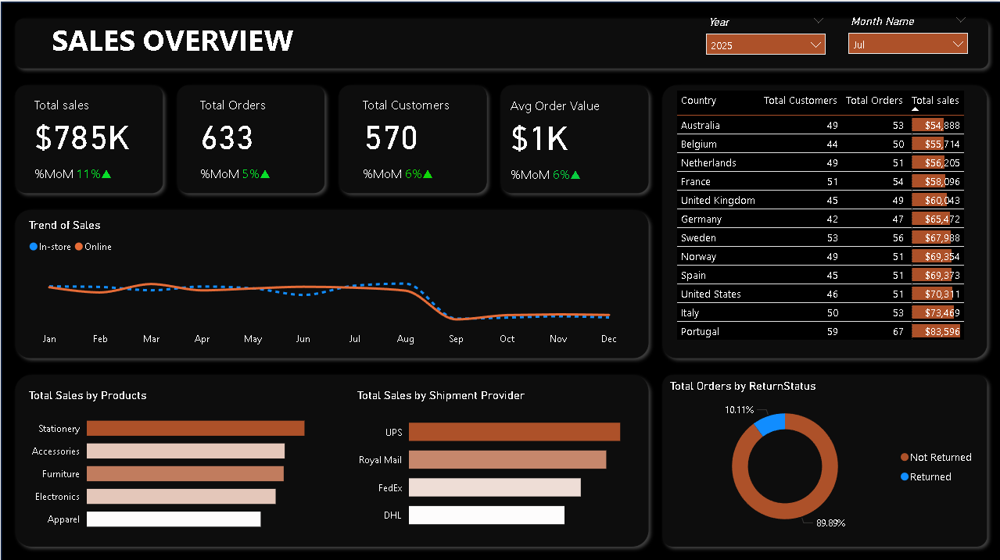
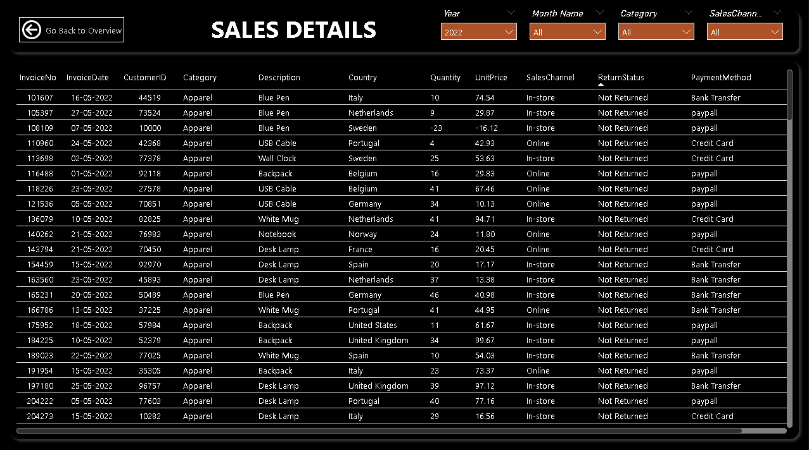

# 🛍️ Sales Insights Dashboard: Online vs In-Store

This Power BI dashboard analyzes sales performance across online and in-store channels using DAX measures created directly in the Tabular Model View (TMDL). The dashboard is designed to help stakeholders quickly grasp business performance metrics like Total Sales, Orders, Customers, and Returns.

---

## 🔧 Key Features
- KPIs: Total Sales ($785K), Orders (633), Customers (570), AOV ($1K)
- MoM% Growth Calculations
- DAX measures built in Model View
- Sales breakdown by Country, Product, Channel
- Shipment Provider & Return Rate Insights
- Drillthrough Table for invoice-level detail
  
---

## 📁 Files Included
- `online_sales.pbix` – Power BI dashboard
- `sales_overview.png` – Dashboard overview snapshot
- `sales_details.png`

---

## 📸 Dashboard Preview

---

## 🛠 Tools Used
- Power BI Desktop
- DAX (Model View / TMDL)
  
---

## 📬 Contact

**Aishwarya SR**  

📧 aishwaryasr097@gmail.com 

🔗 [LinkedIn](https://www.linkedin.com/in/aishwarya-sr/)  

💻 [GitHub](https://github.com/Aiishwarya01)
